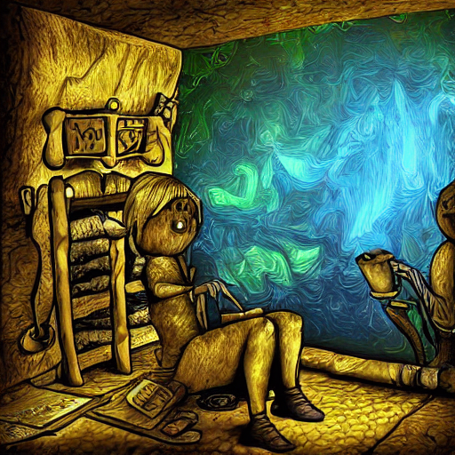
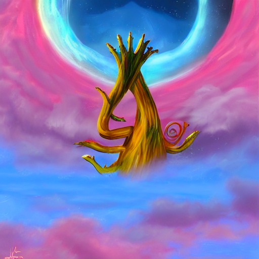

<h1 align="center">
  Diffuse My Lyrics! 
</h1>
<h4 align="center">
  🎶 ➡ 🧠  ➡ 🖼️
</h4>


<h4 align="center">An easy way to generate images from lyrics</h4>

<p align="center">
  <a href="#description">Description</a> •
  <a href="#how-to-use">How To Use</a> •
  <a href="#arguments">Arguments</a> •
  <a href="#cool-outputs">Cool Outputs</a> •
  <a href="#next-steps">Next Steps</a> •
</p>


## Description

This is a simple application that uses the spectacular [Stable Diffusion](https://stability.ai/blog/stable-diffusion-public-release) model to generate images from song lyrics.
So just install the library on a Colab notebook, choose your favorite song and sit back and wait for the visual interpretations of each verse! 

In the Cool Outputs section, I have shown some interpretations of verses that I found very cool 😏😏😏


## How To Use

First, simply install the python package in a colab notebook (right now, it's only for Colab,
but extending it to general use is trivial ... as long as you have a good GPU 😅 ).

```bash
# Install the latest version of the package
$ pip install -U diffuse-my-lyrics
```

Now, suppose we want to feed the model with the following verses, belonging to The End, a magnificent piece by The Doors.

```
Ride the King's highway, baby
Weird scenes inside the gold mine
Ride the highway west, baby
Ride the snake, ride the snake
To the lake, the ancient lake, baby
The snake is long, seven miles
Ride the snake, he's old, and his skin is cold
```

After uploading this lyrics to the colab notebook (I am using a .txt extension), we just need to run the following
commands.

```python
# Import the Lyrics2Images class
from diffuse_my_lyrics import Lyrics2Images

l2i = Lyrics2Images(num_inference_steps=100) # In this case, we are indicating the model to run for 100 steps
l2i.run(input_path="/content/my_favourite_song.txt", output_path="my_favourite_song_folder")
```

After running `Lyrics2Images`, a folder will be created in your colab current directory (`my_favourite_song_folder`), 
where a series of images will be generated (one image for each verse of the lyrics).

One it's finished, simply zip the folder and download it!!

```python
import shutil
shutil.make_archive("zipped_folder", 'zip', "my_favourite_song_folder")
```

## Arguments

- **model_id** - The model id. By default `CompVis/stable-diffusion-v1-4`
- **revision** - The model revision. By default `fp16`
- **torch_dtype** - The Pytorch dtype. By default `torch.float16`
- **prompt** - This parameter is useful if you want to add additional information to the verse. For example, `digital art`,
                `HQ`, etc. By default `digital art`
- **num_inference_steps** - The number of steps. By default `50`
- **use_auth_token** - This parameter determines whether to use an authentication token for Hugging Face. By default
                        `True`

## Cool Outputs

Let me show you now a selection of results I found interesting during my experiments.

### The Doors - The End

`Ride the King's highway, baby`


`Weird scenes inside the gold mine`




`To the lake, the ancient lake, baby`


### The Doors - The crystal ship

`The days are bright and filled with pain`


`The crystal ship is being filled`


### The Pixies - Monkey Gone to Heaven

`An underwater guy who controlled the sea`


`Got killed by ten million pounds of sludge from New York and New Jersey`


`This monkey's gone to heaven`


`The creature in the sky`




## Next Steps

- Add support for generating several images instead of just one.
- Make the library usable in another environments (not just Colab)
- Create argument for using a manual seed
- Add custom size of output images

